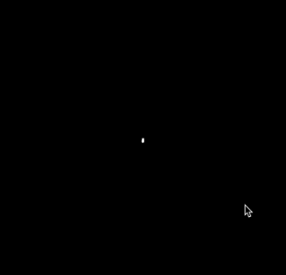

Microphone Oscilloscope
----



This is a web demo which records from 2 microphones to draw an oscilloscope visualization of the recorded audio.

Two microphones are required for this demo to work.

## Install

Clone this repo, then do:

```
npm install
npm start
```

Select the 2 microphones from the list, and go!